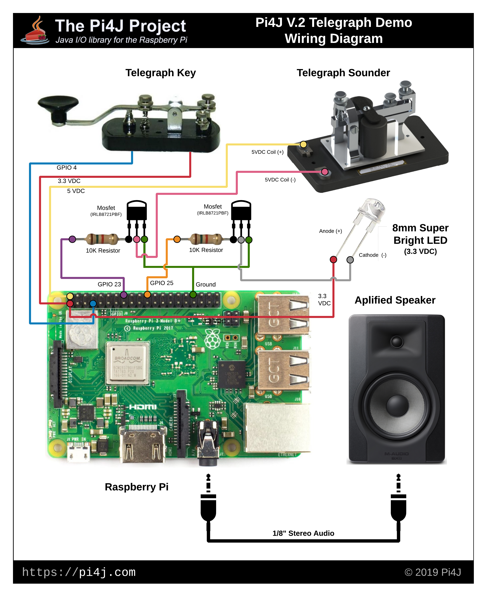

 Pi4J V.2 :: Demo - Telegraph
==========================================================================

---

## DISCLAIMER:: EXPERIMENTAL VERSION

  This demo project is using Pi4J Version 2.0 which is still in development. This demo is provided as sample
  code to demonstrate some of the new features and usage of Pi4J Version 2.0.  Pi4J Version 2.0 is considered 
  experimental and is not ready for production environments at this time.  Pi4J Version 2.0 reserves the 
  right to change any APIs without notice until this version is finally released.
  
  **NOTE:** It is important to note that the pin numbering scheme for Pi4J Version 2.0 has changed.
  Pi4J now adopts the BCM pin numbering scheme as the default numbering scheme and no longer uses
  the WiringPi pin numbering scheme.  

---

## PROJECT INFORMATION

  Project website: https://v2.pi4j.com/  
  Pi4J Community Forum (*new*): https://forum.pi4j.com/  
  Version 2.0 Project Discussions (*new*): https://forum.pi4j.com/category/6/version-2-0  
   
  Pi4J Version 2.0 - Snapshot builds are available from:
   *  [Sonatype OSS] https://oss.sonatype.org/index.html#nexus-search;quick~pi4j

  Copyright (C) 2012-2019 Pi4J

## LICENSE

  Pi4J Version 2.0 and later is licensed under the Apache License,
  Version 2.0 (the "License"); you may not use this file except in
  compliance with the License.  You may obtain a copy of the License at:
      http://www.apache.org/licenses/LICENSE-2.0

  Unless required by applicable law or agreed to in writing, software
  distributed under the License is distributed on an "AS IS" BASIS,
  WITHOUT WARRANTIES OR CONDITIONS OF ANY KIND, either express or implied.
  See the License for the specific language governing permissions and
  limitations under the License.

## PROJECT OVERVIEW

  This demonstration project provides three source files that all perform
  the exact same functionality.  Each of the three source files demonstrate
  different approaches/styles that you can use to utilize the Pi4J libraries
  to interact with the I/O capabilities of the Raspberry Pi.

  * **Telegraph** -- This example uses standard and straight-forward/plain-old 
  Java code to utilize Pi4J.

  * **TelegraphUsingDI** -- This example utilizes the new Pi4J annotation 
  framework to perform runtime dependency injection to wire up the I/O
  interfaces to Pi4J.  This is a very declarative style/approach to using
  the Pi4J APIs. 

  * **TelegraphUsingProperties** -- This example also uses standard and 
  straight-forward/plain-old Java code to utilize Pi4J; however, it loads
  much of the I/O configuration from a properties file opposed to having the
  configuration hard-coded in your source code.

  This demonstration will use the following I/O capabilities of the Raspberry Pi:
  
  * **Digital Input**  -- This demo includes a single digital input that is wired
  up to a telegraph key to listen for input from the telegraph operator.
     
  * **Digital Output**  -- This demo includes two digital outputs that wire up to 
  a telegraph sounder (a physical electro-mechanical device) and a LED (light 
  emitting diode) to both audible and visually monitor the telegraph signals (morse
  code). 

  * **PWM (Pulse Width Modulation)** -- This demo includes two PWM outputs that
  wire up to a LEFT and RIGHT audio channel on an amplified speaker.  This creates 
  a tone to audible monitor the telegraph signals (morse code). 

## WIRING DIAGRAM

  This diagram is using a Raspberry Pi 3B Plus; however any supported Raspberry Pi 
  model can be substituted.  You will just need to verify the GPIO pins and pin numbers 
  for the Raspberry Pi model you decide to use.  
  
  The LED used in this example is not a standard LED that can be driven directly from 
  the GPIO pins.  The LED used here is a **Super Bright LED** (8mm 3.3VDC) that requires 
  more current than the Raspberry Pi GPIO pins can sink/source.  Thus for both the telegraph 
  sounder and the super bright LED we are using a mosfet to switch/control these devices.  
  The mosfet is controlled via the Raspberry Pi GPIO pins and thus in turns allows or 
  restricts current to the device. 

  

  **NOTE:** It is important to note that the pin numbering scheme for Pi4J Version 2.0 has changed.
  Pi4J now adopts the BCM pin numbering scheme as the default numbering scheme and no longer uses
  the WiringPi pin numbering scheme.  
